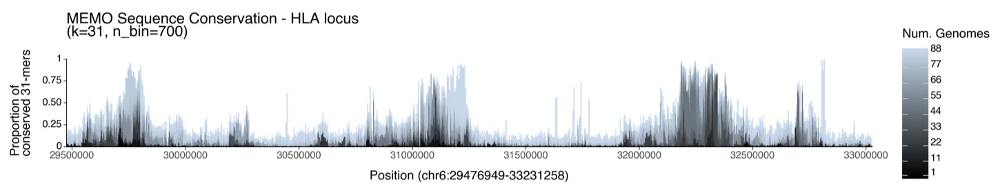

# MEMO: MEM-based pangenome indexing for k-mer queries
Maximal Exact Match Ordered (MEMO) is a pangenome indexing method based on maximal exact matches (MEMs) between sequences.

A single MEMO index can handle arbitrary-length-k k-mer queries over pangenomic windows. MEMO performs membership queries for per-genome k-mer presence/absence and conservation queries for the number of genomes containing the k-mers in a window. MEMO achieves smaller index size and faster queries compared to k-mer-based approaches like KMC3 and PanKmer.

MEMO relies on <a href="https://github.com/maxrossi91/moni">MONI</a> by Massimiliano Rossi for finding pairwise matching statistics between the user-selected pivot genome and all other genomes in a pangenome.


## Installation
TBD

dependencies:
  python:
    python 3.11
    pandas
    numpy
    plotnine
    pyarrow
    numba
  others:
    samtools
    seqtk


## Usage
### Index Creation
To create a MEMO conservation index, specify a list of genomes `-g` and an output location `-o` and prefix `-p`. The first genome in the list of genomes is the pangenome pivot. To create a MEMO membership index, include the `-m` flag.
```sh
./memo index \
  -o output_dir \
  -p output_prefix \
  -g genome_list.txt
```


### Querying k-mer membership and conservation
Once you have created your indexes, specify your length-k `k`, genomic region `-r`, and the total number of genomes in your genome (inclusive of pivot) `-n`. Then run `memo query` for the conservation query. To run the membership query, include the `-m` flag.
```sh
./memo query \
  -b index.parquet \
  -k k \
  -n num_genomes \
  -r chr:start-end \
  -o memo_membership.txt
```

## Visualizing sequence conservation
<figure>

<figcaption> <p align="center">31-mer sequence conservation of the Human Leucocyte Antigen locus in the HPRC pangenome.</p></figcaption>
</figure>

From the MEMO conservation query, MEMO can visualize sequence conservation:
```sh
./memo view \
  -i memo_conservation.txt \
  -o out.png \
  -n num_genomes \
  -b num_bins
```

